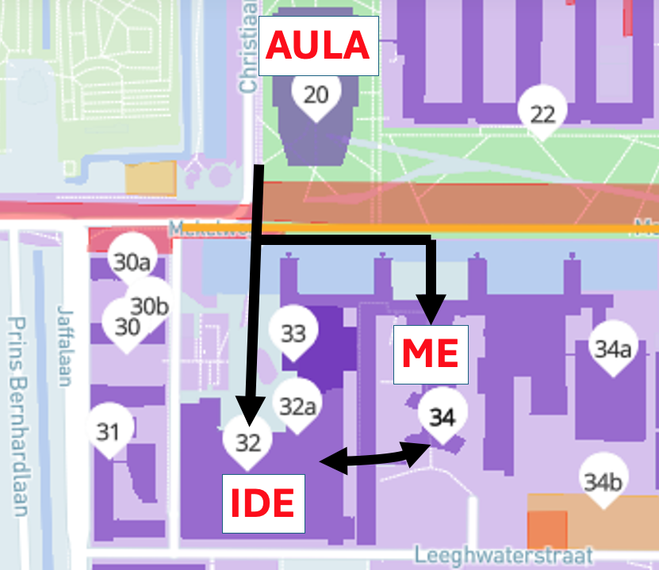

**Date**: 19th of July 2024

**Location**: **Aula Commissiekamer 2** at **TU Delft** (n. 20 on the maps) at the [Robotics Science and Systems 2024 (RSS 2024)](https://roboticsconference.org/) confererence, Delft (Netherlands) 

**Zoom**: [Link](https://uu-se.zoom.us/j/63875356687)

**Time**: 2PM - 6PM

## Program

GROUND 2024 will be a **Half Day** Workshop. Participants are invited to present their contribution in the form of **posters** to facilitate open discussion in groups.

| Time (GMT+2)  | Activity                                  | Duration             |
|:-------------:|:-----------------------------------------:|:--------------------:|
|2:00 PM        | Ice-breaking activity                     | 30 min               |
|2:30 PM        | **Keynote Talk** - Sarah Sebo             | 30 min               |
|3:00 PM        | **Lightning Talk** - Sarah Gillet         | 20 min               |
|3:20 PM        | Carousel Poster Presentation              | max 2 min per poster |
|3:30 PM        | Coffee Break + Poster Session             | 40 min               |
|4:10 PM        | **Keynote Talk** - Randy Gomez            | 30 min               |
|4:40 PM        | **Lightning Talk** - Raquel Ros           | 20 min               |
|5:00 PM        | (G)Round Table                            | 60 min               |

For any inquiry, please contact us at [workshop.ground@gmail.com](mailto:workshop.ground@gmail.com).

---

## Keynote Speakers

<section class="light">
    

        <article class="postcard light blue">
            
            

                <h1 class="postcard__title blue">Sarah Sebo</h1>
                

				Assistant Professor, University of Chicago
				

                

                
<b>Designing Social Robots to Positively Shape Interactions with Groups of People</b> 
			        With continued advances in computing, robots are becoming increasingly capable of performing physical tasks and engaging socially with people. As robots enter roles in food delivery, child tutoring, older adult assistance, and more, robots will engage both physically and socially with people, individually and in groups. This talk focuses on the potential ways that the social behavior of robots can both positively and negatively shape interactions between people within a group through human-robot interaction roles, supportive verbal statements, and ice-breaking questions. The implications of the work I will highlight the need for researchers and practitioners in HRI and robotics to consider deeply and to continue to research the potential impacts that a robot's behaviors have to shape important human-human interactions within a group. 
		        

            

        </article>
        <article class="postcard light blue">
			
			

				<h1 class="postcard__title blue">Randy Gomez</h1>
				

				    Chief Scientist, Honda Research Institute Japan
				

				

				
<b>Robots for Society: Enhancing Well-Being through Socio-Cultural Integration</b> 
                Social robots have been successfully deployed in human-robot interaction settings, demonstrating socially acceptable behavior. Recently, social robots have begun to undertake tasks that replicate the role of a friend, fostering personal relationships through empathetic interactions that can ultimately enhance individual well-being. This presentation expands the concept of social robots to "robots for society," emphasizing their societal impact by integrating socio-cultural foundations into the current social robot context. Additionally, we will present our work on developing robots with social embedding focusing on group interactions in both school and hospital environments.
                

			

		</article>
    

</section>

 ---

## Lightning Speaker

<section class="light">
    

        <article class="postcard light blue">
            
            

                <h1 class="postcard__title blue">Sarah Gillet</h1>
                

				PhD Candidate, KTH
				

                

                
<b>Computational Approaches to Interaction-Shaping Robotics</b> 
			        Humans thrive on positive social interactions, yet dominance, competence and inclusion issues can create hurdles.  Research suggests robots can support interactions between people.  However, for real-world applications and deployment, we need to develop autonomous social robots that can interact with multiple people and adapt to human-human dynamics.  This talk explores the importance of such adaptation, showcasing how robots using simple perception and rules can significantly shape interactions positively. To pave the way for more complex interactions, the talk delves into leveraging machine learning techniques like reinforcement learning and imitation learning. It will discuss how to implement these techniques while ensuring the robot acts appropriately throughout learning and deployment.
                

            

        </article>
        <article class="postcard light blue">
            
            

                <h1 class="postcard__title blue">Raquel Ros</h1>
                

				Senior Scientist, PAL Robotics
				

                

                
<b>Exploring In-the-Wild Multi-Party Human-Robot Interactions</b> 
			        Like many other issues, transitioning from one to many is not straightforward. This is especially true in the field of Human-Robot Interaction, where one-to-one interactions are still not fully understood or resolved. However, we cannot afford to wait until these issues are completely addressed before tackling the problem of many-to-many interactions. There are numerous scenarios that only occur in multi-party contexts, and we must approach them from this unique perspective. In this talk, I will not offer solutions but will highlight real-world situations where our robots need to manage multiple multi-modal interactions. These examples will illustrate the complexity of the problem and, hopefully, provide valuable insights into the challenges our community must tackle in the coming years.
                

            

        </article>
    

</section>

---

## Accepted Papers

#### Moderating Group Conversation Dynamics with Social Robots
*Lucrezia Grassi, Carmine Recchiuto and Antonio Sgorbissa* 

This research investigates the impact of social robot participation in group conversations and assesses the effectiveness of various addressing policies. The study involved 300 participants, divided into groups of four, interacting with a humanoid robot serving as the moderator. The robot utilized conversation data to determine the most appropriate speaker to address. The findings indicate that the robot's addressing policy significantly influenced conversation dynamics, resulting in more balanced attention to each participant and a reduction in subgroup formation.

#### Egocentric Robots in a Human-Centric World? Exploring Group-Robot-Interaction in Public Spaces
*Ana Müller and Anja Richert* 

The deployment of social robots in real-world sce- narios is increasing, supporting humans in various contexts. However, they still struggle to grasp social dynamics, especially in public spaces, sometimes resulting in violations of social norms, such as interrupting human conversations. This behavior, originating from a limited processing of social norms, might be perceived as robot-centered. Understanding social dynamics, particularly in group-robot-interactions (GRI), underscores the need for further research and development in human-robot- interaction (HRI). Enhancing the interaction abilities of social robots, especially in GRIs, can improve their effectiveness in real- world applications on a micro-level, as group interactions lead to increased motivation and comfort. In this study, we assessed the influence of the interaction condition (dyadic vs. tridaic) on the perceived extraversion (ext.) of social robots in public spaces. The research involved 40 HRIs, including 24 dyadic (i.e., one human and one robot) interactions and 16 triadic interactions, which involve at least three entities, including the robot.

#### Multi-Party Open-Ended Conversations with the Furhat robot
*Martijn Catrycke, Giulio Antonio Abbo, Maria Jose Pinto Bernal and Tony Belpaeme* 

This paper presents the implementation and evaluation of a conversational agent designed for multi-party open-ended interactions. Leveraging state-of-the-art technologies such as voice direction of arrival, voice recognition, face tracking, and large language models, the system aims to facilitate natural and intuitive human-robot conversations. Deployed on the Furhat robot, the system was tested with 30 participants engaging in open-ended discussions. Quantitative metrics, such as latencies and recognition accuracy, along with qualitative measures from user questionnaires, were collected to assess performance. The results highlight the system's effectiveness in managing multi-party interactions, though improvements are needed in response relevance and latency. This study contributes valuable insights for advancing human-robot interaction, particularly in enhancing the naturalness and engagement in group conversations.

#### CAMON: Cooperative Agents for Multi-Object Navigation with LLM-based Conversations
*Pengying Wu, Yao Mu, Kangjie Zhou, Ji Ma, Junting Chen and Chang Liu* 

Visual navigation tasks are critical for household service robots. As these tasks become increasingly complex, effective communication and collaboration among multiple robots become imperative to ensure successful completion. In recent years, large language models (LLMs) have exhibited remarkable comprehension and planning abilities in the context of embodied agents. However, their application in household scenarios, specifically in the use of multiple agents collaborating to complete complex navigation tasks through communication, remains unexplored. Therefore, this paper proposes a framework for decentralized multi-agent navigation, leveraging LLM-enabled communication and collaboration. By designing the communication-triggered dynamic leadership organization structure, we achieve faster team consensus with fewer communication instances, leading to better navigation effectiveness and collaborative exploration efficiency. With the proposed novel communication scheme, our framework promises to be conflict-free and robust in multi-object navigation tasks, even when there is a surge in team size.

#### Shaping Perceptions: The Impact of Dynamic Agent Behaviors and Embodiments in Multiparty Cards Game
*Laura Triglia, Francesco Rea and Alessandra Sciutti* 

This study investigates how different agent behaviors and embodiments impact human perception in group interactions involving humans, robots, and agents. Using the Chef's Hat card game as a testbed, we explore the effects of varying agent reactions on human players' strategies and perceptions. The humanoid robot iCub, equipped with reinforcement learning agents using the Moody Framework, serves as the central robotic platform. This framework allows agents to dynamically adjust their behaviors based on internal state assessments, generating contextually appropriate reactions. Our experiment aims to demonstrate that these dynamic reactions significantly influence human perceptions of the agents, offering new insights into the design of responsive and socially aware robotic systems. This research wants to contribute to the field of human-robot interaction by providing a deeper understanding of how agent behavior and embodiment affect human interaction within a competitive group setting.

#### Anticipation through Head Pose Estimation: a preliminary study
*Federico Figari Tomenotti and Nicoletta Noceti* 

The ability to anticipate others' goals and intentions is at the basis of human-human social interaction. Such ability, largely based on non-verbal communication, is a key to having natural and pleasant interactions with artificial agents, like robots. In this work, we discuss a preliminary experiment on the use of head pose as a visual cue to understand and anticipate action goals, particularly reaching and transporting movements. By reasoning on the spatio-temporal connections between the head, hands and objects in the scene, we will show that short-range anticipation is possible, laying the foundations for future applications to the robotics domain.

---

<small class="text-muted">Banner designed by Chahin Mohamed. "Lo-Fi Cyberpunk animated". August, 2021. <a>https://dribbble.com/shots/18947748-Lo-Fi-Cyberpunk-animated</a></small>

