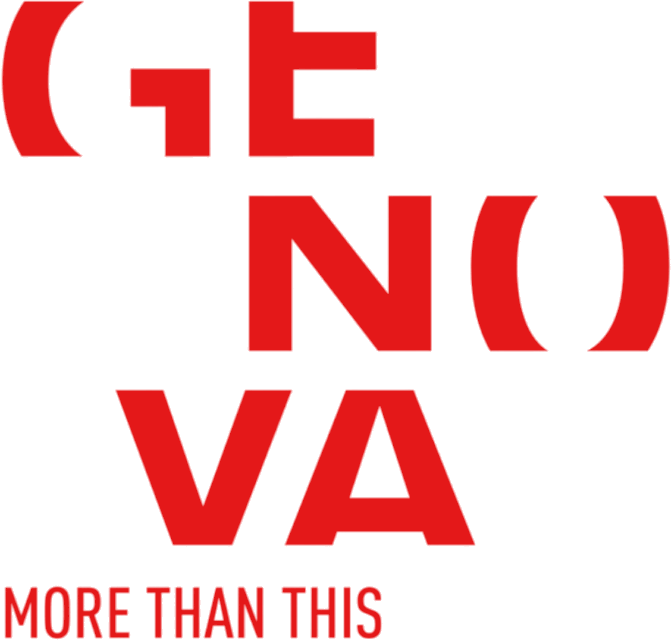
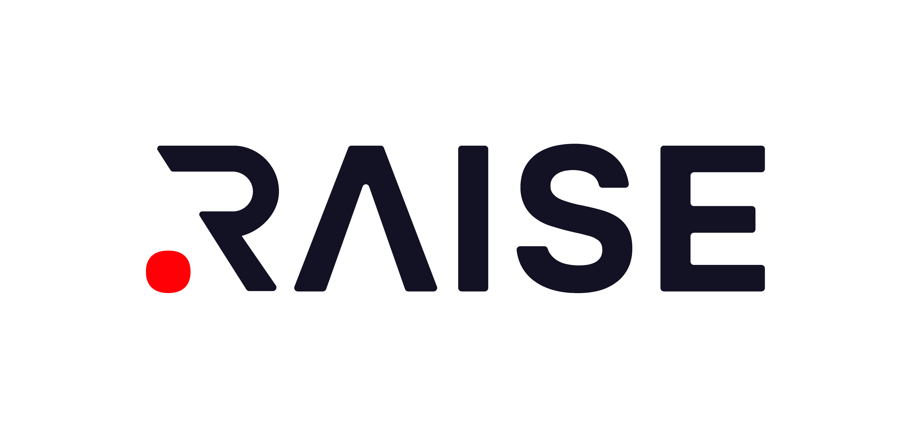
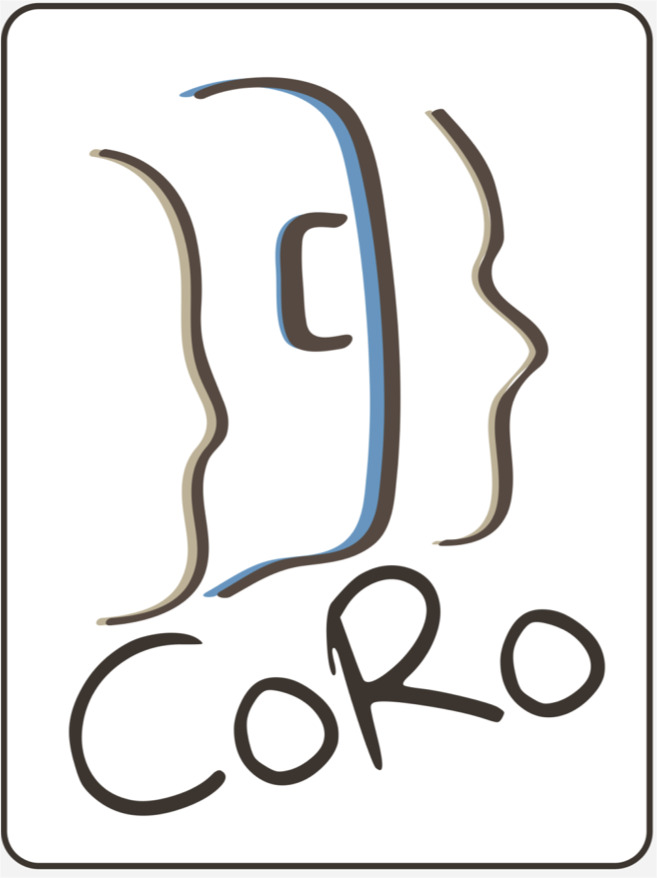
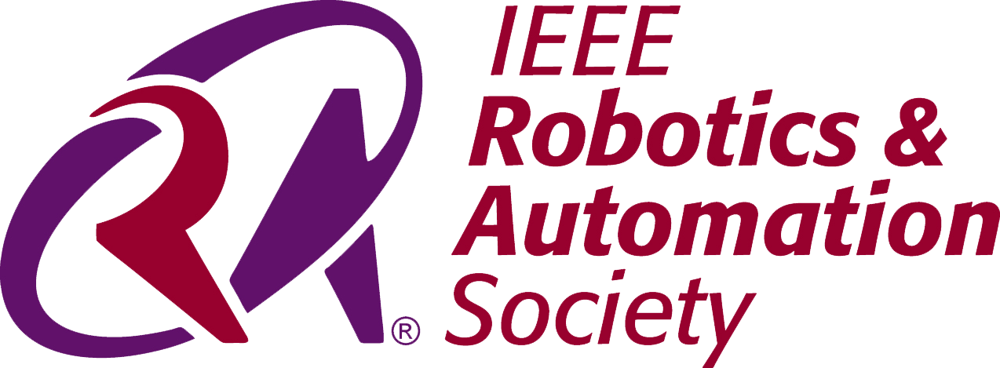

### Workshop Theme & Topics of Interest

The proposed workshop aims to provide a <b>cutting-edge perspective on group interactions in the field of robotics and promote the development of adaptive robots' behavior in multiparty contexts</b>. In the words of John Donne <code>“No man is an island”</code> (1624): individuals are extremely influenced by others in their life (e.g., <i>Turner, 1994; Baumeister, 2011</i>).  

As collaborative and assistive robots become more prevalent in our daily lives and are introduced into multi-party scenarios that require interaction with humans, such as workplaces, schools, and care facilities, it is crucial to ensure that <b>their behavior considers the complex dynamics of these contexts</b> (e.g., <i>Belpaeme et al., 2018; Schneiders et al., 2022; Sebo et al., 2020</i>).  

Moreover, robots have been shown to be effective tools for studying social and physical interactions in groups, providing valuable insights into how human group dynamics can be modeled, enhanced, and ultimately predicted (e.g., <i>Leite et al., 2012; Alves-Oliveira et al., 2019; Strohkorb Sebo et al., 2018</i>). The study of group dynamics in HRI entails inherent challenges from both a technical (e.g., tracking multiple users simultaneously) and a theoretical point of view (e.g., modeling multiple agents whose behavior dynamically influences each other during decision making tasks).  

Participants are invited to share innovative strategies for exploring group-robot interactions, providing a fresh and insightful viewpoint to: (1) <b>using social robots for understanding group dynamics</b>; (2) <b>designing robots able to interact with groups</b>. Also, the discussion will involve the ethical implications of researching group dynamics, including potential negative outcomes such as biases towards group members.

Topics of interests include but are not limited to:
* Understanding group dynamics through the use of social robots.
* Designing social robots able to interact with groups.
* Gamification in multiparty human-robot interactions.
* Promoting natural communication, mutual understanding and trust in human-robot mixed groups.
* Exploring different robot’s roles (e.g., peer, teacher, helper or friend) in group interactions.
* Interdisciplinary collaborations between roboticists, game designers, psychologists, and sociologists.
* Novel experimental designs for conducting group-robot interaction research.
* Ethical considerations in researching group dynamics and potential biases or negative consequences.
* Adaptation and personalization to groups.
* Learning strategies for autonomous behaviors of robots in groups.
* Modelling, understanding and predicting group behaviors.

These topics are meant to be suggestive and not exhaustive, contributions to other relevant topics will also be taken into consideration, as long as they fit with the general theme of the workshop. 

---

### Statement of Inclusion, Diversity and Equity 

The workshop organizers are committed to creating an inclusive, diverse, and equitable environment for all attendees. We recognize and value the diversity of our attendees and understand that people have different needs and preferences. To accommodate the different time zones of attendees, the workshop will be held in a hybrid format and will be recorded for later viewing. To ensure that all attendees have reliable access to the internet, we will provide technical support and troubleshooting assistance as needed. We encourage attendees from underrepresented groups to submit their work and participate in the workshop. We are committed to creating an equitable and diverse environment, and we are open to suggestions on how to improve the workshop in terms of inclusion and accessibility. 

---

### Supported by

<table>
  <tr>
    <!--<td>  </td>-->
    <!--<td>  </td>-->
    <!--<td>  </td>-->
  </tr>
  <tr>
    <!--<td>  </td>-->
    <!--<td>  </td>-->
    <!--<td>  </td>-->
  </tr>
</table>

---

<small class="text-muted">Spalsh art designed by Chahin Mohamed. "Scribbly Robot Frands". June, 2021. <a>https://www.artstation.com/artwork/B1PAAk</a></small>

