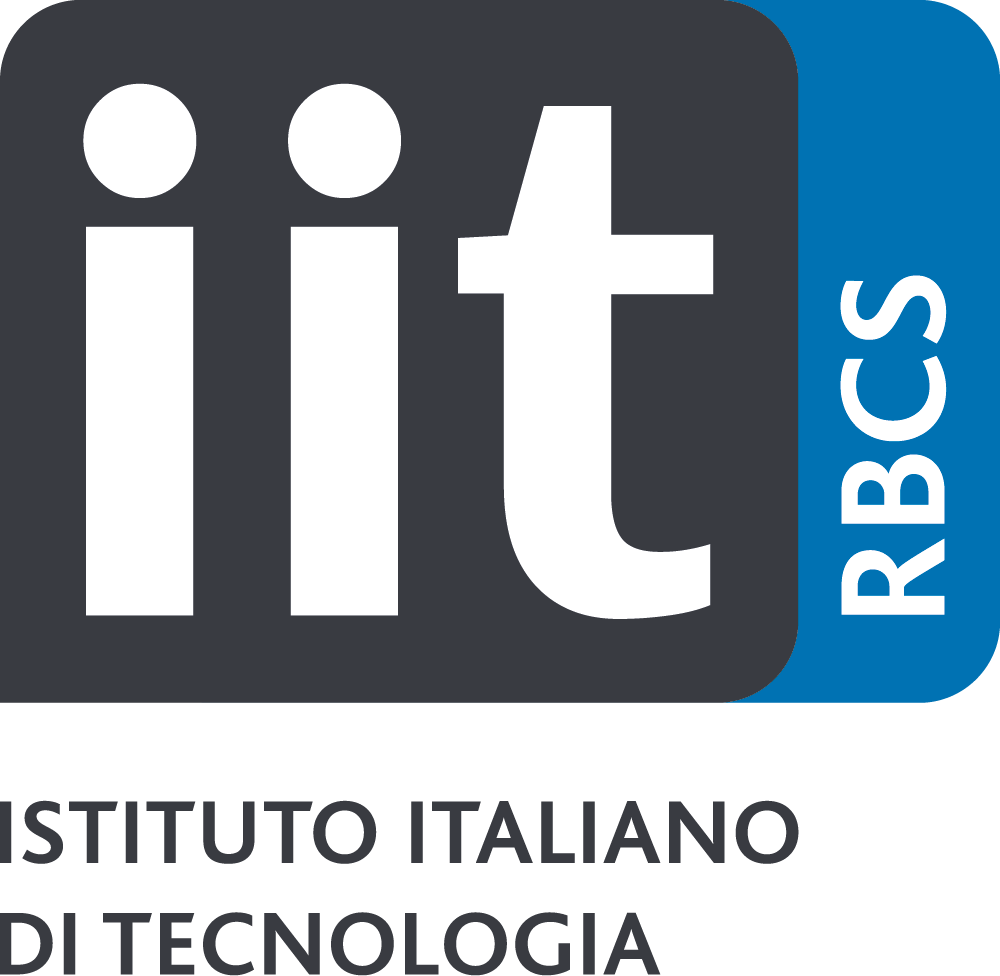

### Workshop Theme & Topics of Interest

The proposed workshop aims to provide a cutting-edge perspective in the field of group-robot interactions, to promote the <b>development of robots that are aware of group dynamics</b> and <b>can adapt their behavior to complex multiparty interactions</b>, and to discuss how to bring this field in alignment with the existing guidelines on <b>ethical and transparent human-robot interaction</b>.   

As collaborative and assistive robots are increasingly integrated in settings like workplaces, schools, and care facilities, it is crucial to ensure their behavior aligns with the complex dynamics of multiparty contexts (Belpaeme et al., 2018; Schneiders et al., 2022; Sebo et al., 2020). Robots have already been shown to be effective tools for studying group interactions socially and physically, offering insights into modeling, enhancing, and predicting human group dynamics (e.g., Leite et al., 2012; Alves-Oliveira et al., 2019; Strohkorb Sebo et al., 2018). However, studying group dynamics in HRI entails challenges from both a technical (e.g., tracking multiple users simultaneously) and a theoretical point of view (e.g., modeling agents with reciprocal influence during decision-making tasks).   

Additionally, keeping up with the recent proposed guidelines and legislations on trustworthy and ethical human-agent and human-robot interaction (such as the ALTAI guidelines on Trustworthy AI and the EU AI Act), the ethical dimension of this research needs also to be reflected in its design, by spotlighting the transparency of the robot, exploring the user agency and sense of autonomy, as well as ensuring the diversity of the studies.   

Participants are invited to share innovative strategies for exploring group-robot interactions, providing a fresh and insightful viewpoint on: (1) using robots for understanding group dynamics; (2) designing robots able to interact with groups; (3) exploring the specific ethical challenges when working on group-robot interaction. In addition, the discussion will involve the ethical implications of researching group dynamics, including potential negative outcomes such as biases towards group members. 

Topics of interests include but are not limited to:
* Understanding group dynamics using robots.
* Promoting natural communication, mutual understanding and trust in human-robot mixed groups.
* Adaptation and personalization to groups.
* Learning strategies for autonomous behaviors of robots in groups.
* Designing robots able to interact with groups.
* Modelling, understanding and predicting group behaviors.
* Exploring different robot’s roles (e.g., peer, teacher, helper or friend) in group interactions.
* Gamification in multiparty human-robot interactions.
* Interdisciplinary collaborations between roboticists, game designers, psychologists, and sociologists.
* Novel experimental designs for conducting group-robot interaction research.
* Ethical considerations in researching group dynamics and potential biases or negative consequences.

These topics are meant to be suggestive and not exhaustive, contributions to other relevant topics will also be taken into consideration, as long as they fit with the general theme of the workshop. 

---

### Statement of Inclusion, Diversity and Equity 

The workshop organizers are committed to creating an inclusive, diverse, and equitable environment for all attendees. We recognize and value the diversity of our attendees and understand that people have different needs and preferences. To accommodate the different time zones of attendees, the workshop will be held in a hybrid format and will be recorded for later viewing. To ensure that all attendees have reliable access to the internet, we will provide technical support and troubleshooting assistance as needed. We encourage attendees from underrepresented groups to submit their work and participate in the workshop. We are committed to creating an equitable and diverse environment, and we are open to suggestions on how to improve the workshop in terms of inclusion and accessibility. 

---

# Supported By

<!--This workshop is partially supported by the Project **[Future Artificial Intelligence Research (FAIR)](https://fondazione-fair.it/)**, code PE000013 funded by the European Union - NextGenerationEU PNRR MUR - M4C2 - Investimento 1.3 - Avviso Creazione di "Partenariati estesi alle università, ai centri di ricerca, alle aziende per il finanziamento di progetti di ricerca di base" CUP J53C22003010006 and by the Horizon Europe **EIC project [SymAware](https://symaware.eu)** under the grant agreement 101070802.-->

<table>
  <tr>
    <!--<td>  </td>-->
    <!--<td>  </td>-->
    <td>  </td>
    <td>  </td>
    <td>  </td>
    <!--<td>  </td>-->
    <!--<td>  </td>-->
    <!--<td>  </td>-->
    <!--<td>  </td>-->
    <!--<td>  </td>-->
  </tr>
</table>

---

<small class="text-muted">Splash art designed by Chahin Mohamed. "Scribbly Robot Frands". June, 2021. <a>https://www.artstation.com/artwork/B1PAAk</a></small>

